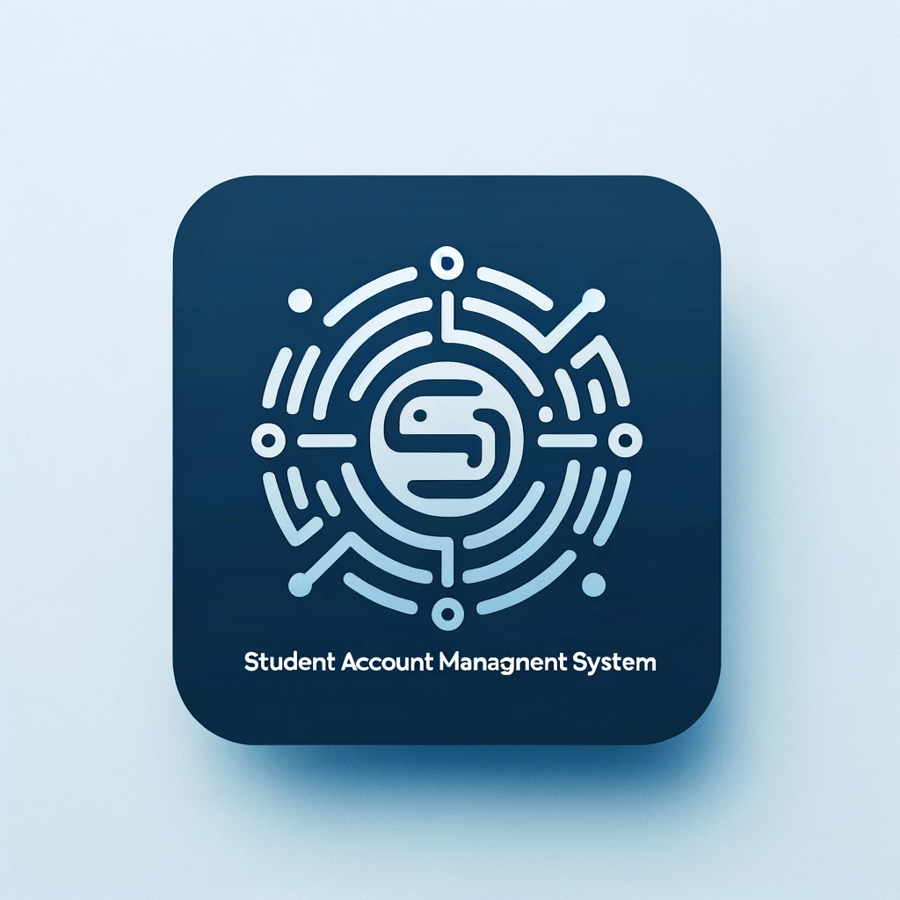

# Student Account Management System - SAMS



The Student Grade Management System is a Python application that allows you to manage student information, including adding students, assigning grades, and generating reports. This system uses a CSV file to store and retrieve student data.


## Table of Contents
- [Features](#features)
- [Installation](#installation)
- [Usage](#usage)
- [Menu Options](#menu-options)
- [File Structure](#file-structure)
- [Contributing](#contributing)
- [License](#license)

## Features

- **Add Student**: Add a new student with a unique ID, name, and grade.
- **Remove Student**: Remove an existing student using their ID.
- **Update Student**: Update the name or grade of an existing student.
- **Add Grade**: Assign grades for specific subjects to students.
- **Get Student Average**: Calculate and display the average grade of a student.
- **Get Student Details**: Retrieve and display detailed information about a specific student.
- **Display All Students**: Display the information of all students in the system.
- **Generate Report**: Generate a report containing student IDs, names, grades, and average grades.
- **Export Report**: Export the generated report to a CSV file.
- **Save Data**: Save the current student data to a CSV file.
- **Load Data**: Load student data from an existing CSV file.

## Installation

1. Clone the repository:

    ```sh
    git clone https://github.com/abhiverse01/sams.git
    cd sams
    ```

2. Ensure you have Python installed (version 3.6+ recommended).

3. Install any required dependencies (none for this basic script).

## Usage

Run the application:

```sh
python sams.py
```

## Menu Options

1. Add Student: Enter student ID, name, and grade to add a new student.

2. Remove Student: Enter the student ID to remove a student.

3. Update Student: Enter the student ID and new name or grade to update a student's information.

4. Add Grade: Enter the student ID, subject, and grade to assign a grade to a student.

5. Get Student Average: Enter the student ID to calculate and display the average grade.

6. Get Student Details: Enter the student ID to retrieve detailed information about a student.

7. Display All Students: Display information of all students.

8. Generate Report: Generate a report with student information and average grades.

9. Export Report: Export the generated report to a CSV file.

10. Save Data: Save the current student data to students.csv.

11. Exit: Exit the application.

## File Structure

- **sams.py**: Main application file.
- **students.csv**: CSV file to store student data.
- **report.csv**: CSV file to store report data.
- **README.md**: The Readme for this project.

## Contributing

- Contributions are welcome! Please fork the repository and submit a pull request.

## License
- This project is licensed under the MIT License. [MIT](https://choosealicense.com/licenses/mit/)
